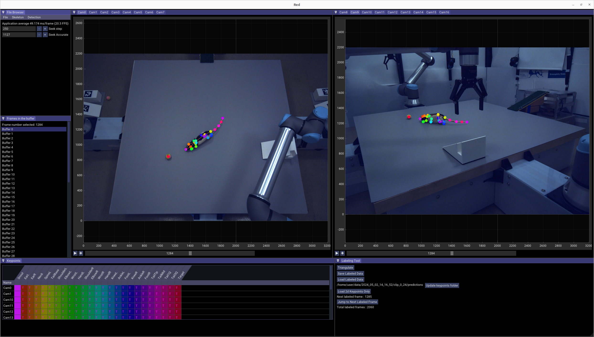

# red labeling 📍

A 3D multi-camera labeling tool for fast review and triangulation across many synchronized video streams. Built in C++.



## Overview

`red` is the labeling counterpart to [orange](https://github.com/moments-behavior/orange). It takes multi-view video (typically recorded with `orange`) and lets you label keypoints across all camera views simultaneously, with real-time GPU decoding (h264 / hevc), synchronized playback across all cameras, and multi-view triangulation. Labeled data can be exported for downstream training (YOLO detection, YOLO pose, JARVIS).

## Documentation

Full documentation — installation, configuration, data export — lives at the [moments-behavior docs site](https://moments-behavior.github.io/docs/red/).

[Video demo](https://www.youtube.com/watch?v=9eOJaadE1Nc)

## Quick build

Linux-only. Requires NVIDIA GPU with CUDA + cuDNN. See the docs for full system requirements and the dependency install walkthrough.

```bash
git clone --recursive https://github.com/moments-behavior/red.git
cd red
./build.sh    # builds release/red
./run.sh
```

## Authors

**Red** is developed by Jinyao Yan, with contributions from Wilson Chen, Diptodip Deb, Ratan Othayoth, and Rob Johnson.

Contact [Jinyao Yan](mailto:yanj11@janelia.hhmi.org) with questions about the software.

## Citation

If you use **Red**, please cite the software:

```bibtex
@software{moments_behavior_red_2026,
  author       = {Yan, Jinyao and
                  Deb, Diptodip and
                  Chen, Wilson and
                  Othayoth, Ratan and
                  Johnson, Rob},
  title        = {moments-behavior/red: v1.1.0},
  month        = apr,
  year         = 2026,
  publisher    = {Zenodo},
  version      = {v1.1.0},
  doi          = {10.5281/zenodo.19688190},
  url          = {https://doi.org/10.5281/zenodo.19688190},
}
```

## Contribute

Please open an issue for bug fixes or feature requests. If you wish to make changes to the source code, fork the repo and open a [pull request](https://docs.github.com/en/pull-requests/collaborating-with-pull-requests/proposing-changes-to-your-work-with-pull-requests/creating-a-pull-request).
