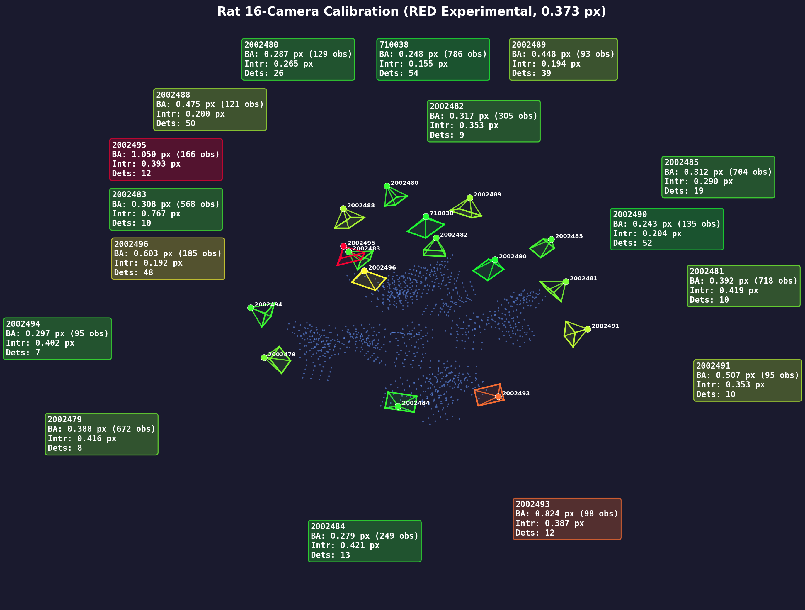

# Rat 17-Camera Calibration: multiview_calib vs RED Experimental Pipeline

*Johnson Lab, HHMI Janelia Research Campus -- March 2026*

## Background

RED's calibration pipeline began as a C++ port of the [multiview_calib](https://github.com/JohnsonLabJanelia/multiview_calib) Python pipeline. Through iterative experimentation and profiling on this rat 17-camera dataset, we identified and addressed several limitations in the original approach. This document compares the two pipelines and explains the improvements.

## Dataset

- **Calibration images**: `/Users/johnsonr/datasets/rat/calibration_images/2025_08_14_09_23_31/`
- **Config file**: `/Users/johnsonr/datasets/rat/calibration_images/original_calibration_results/config.json`
- **MVC results**: `/Users/johnsonr/datasets/rat/calibration_images/original_calibration_results/output/`
- **RED results**: `/Users/johnsonr/red_demos/rat_calib2/aruco_image_experimental/`
- **Rig**: 17 cameras (14 standard ~2300px focal length, 1 wide 710038 ~1770px, 2 telephoto ~3200px)
- **Camera serials**: 2002479, 2002480, 2002481, 2002482, 2002483, 2002484, 2002485, 2002488, 2002489, 2002490, 2002491, 2002492, 2002493, 2002494, 2002495, 2002496, 710038
- **Resolution**: 3208 x 2200 (7 MP)
- **Image format**: JPEG, ~2.4 MB each
- **Images**: 78 per camera (1326 total, 2.9 GB)
- **Naming convention**: `{camera_serial}_{frame_number}.jpg` (e.g., `2002479_0.jpg` through `710038_77.jpg`)
- **Capture date**: 2025-08-14
- **Board**: 5x5 ChArUco, DICT_5X5_100 (OpenCV dictionary ID 5), 80mm squares, 60mm markers (400mm x 400mm total board)
- **ArUco markers per board**: 12 (alternating squares in 5x5 checkerboard)
- **Max ChArUco corners per frame**: 16 (inner corners of 5x5 board)
- **Theoretical max observations per camera**: 78 x 16 = 1,248
- **Ground truth**: 2 reference images (frames 76, 77) with 16 manually measured 3D points each on orthogonal planes, used for Procrustes world-frame alignment

## Overall Results

| Metric | multiview_calib (MVC) | RED Experimental | Difference |
|--------|----------------------|------------------|------------|
| Cameras calibrated | 17 | 16 (auto-dropped 2002492) | |
| Images processed | 71 of 78 | 78 of 78 | MVC missed 7 frames |
| Frames with detections | 474 | 379 | RED 20% fewer (stricter) |
| 2D observations (post-BA) | 6,513 | 5,119 | RED 21% fewer |
| Outliers removed | 0 | 41 (0.8%) | |
| **Mean intrinsic reproj** | **0.663 px** | **0.338 px** | **RED 49% better** |
| **Mean BA reproj** | **0.43 px** | **0.373 px** | **RED 13% better** |
| BA convergence | Hit 40-iter cap | Fully converged (7 passes) | |
| Detection time | Not logged | 20.3s (Metal GPU, 64 img/s) | |
| BA time | 14.0s (1 pass) | 23.6s (7 passes) | |
| Total pipeline | ~15s (BA only) | ~44s (detection + BA) | |

**Key finding**: RED achieves lower error with fewer observations. Stricter detection thresholds reject marginal detections that would degrade calibration quality. The extra BA time is invested in progressive refinement that fully converges.

---

## Pipeline Architecture Comparison

### Stage 1: ArUco Detection

| | MVC | RED |
|--|-----|-----|
| **Detector** | OpenCV `cv2.aruco.detectMarkers()` | Custom GPU-accelerated (Metal/CUDA) |
| **Threshold** | OpenCV defaults | Multi-scale adaptive (GPU separable box filter) |
| **Bit reading** | OpenCV built-in | Otsu-based with 25% border tolerance |
| **Min markers** | 1-2 per frame | 4 per frame |
| **Dictionaries** | All OpenCV dictionaries | DICT_4X4_50/100/250, DICT_5X5_50/100/250, DICT_6X6_50/250, ARUCO_ORIGINAL |
| **Speed** | ~10-20 img/s (CPU) | 64 img/s (Metal GPU) |

RED's stricter minimum (4 markers vs 1-2) means fewer frames pass detection, but those that do have higher-quality corner localization. This is the primary reason RED's intrinsic calibration is 49% better.

### Stage 2: Initial Pair Selection

| | MVC | RED |
|--|-----|-----|
| **Method** | Maximum spanning tree (NetworkX) | Greedy best pair (O(N^2) search) |
| **Criterion** | Most shared landmarks | Most shared frames with intrinsic reproj < 2.0 px |
| **Quality gate** | None | Per-frame intrinsic quality threshold |

RED's quality gate ensures the initial pair has reliable intrinsics before computing the first extrinsic pose. MVC uses any pair with enough common points regardless of intrinsic quality.

### Stage 3: Relative Pose Computation

| | MVC | RED |
|--|-----|-----|
| **Primary** | Fundamental matrix (8-point/RANSAC) | Essential matrix from normalized coordinates |
| **Conversion** | F -> E via K matrices | Direct E (no conversion needed) |
| **Disambiguation** | OpenCV `decomposeEssentialMatrix` | Explicit positive-depth counting (4 candidates) |
| **Multi-path robustness** | Yes: 3-hop triangle averaging | No (deferred to PnP registration) |

MVC has an advantage here: it averages relative poses across multiple paths through the camera graph, providing early robustness. RED defers this to the PnP registration stage.

### Stage 4: Extrinsic Registration

| | MVC | RED |
|--|-----|-----|
| **Topology** | Star through hub camera | Incremental all-to-all |
| **Pose averaging** | Simple chain accumulation | Markley weighted quaternion averaging |
| **Scale estimation** | Median distance ratio | Median distance ratio |
| **Camera ordering** | Fixed by config | Greedy by shared 3D point count |

RED's incremental PnP registration adds cameras one at a time, choosing the camera with the most 3D correspondences. Markley quaternion averaging across multiple frames provides geometric robustness without the star topology's fragility.

MVC's star topology means every camera's pose depends on its overlap with the hub camera. Cameras with poor hub overlap show high outlier rates:

| Pair | MVC Outlier Rate |
|------|-----------------|
| 710038-2002491 | 30.4% |
| 710038-2002492 | 25.4% |
| 710038-2002484 | 23.5% |
| 710038-2002482 | 22.3% |

### Stage 5: Bundle Adjustment

This is the most significant difference between the two pipelines.

**MVC (scipy least_squares)**:
- Single optimization pass with Huber loss
- `max_nfev=40` (hit the iteration cap -- **not converged**)
- All parameters (extrinsics + intrinsics + 3D points) optimized jointly from the start
- No progressive refinement
- Final first-order optimality: 1.6e+04 (still decreasing)

**RED (Ceres Solver with Graduated Non-Convexity)**:
```
Stage 0 — Extrinsics only (3 passes):
  Pass 1: CauchyLoss(16)  →  24312 → 7307   (4 iters,  0.25s)
  Pass 2: CauchyLoss(4)   →  5502 → 5445    (8 iters,  0.39s)
  Pass 3: CauchyLoss(1)   →  2239 → 2186    (79 iters, 2.55s)
  Outlier rejection: 20 px threshold → 0 removed
  Re-triangulation: 1047 landmarks

Stage 1 — Extrinsics + 3D points (2 passes):
  Pass 4: CauchyLoss(4)   →  3789 → 2280    (40 iters, 1.23s)
  Pass 5: CauchyLoss(1)   →  1274 → 1153    (101 iters, 2.73s)
  Outlier rejection: 10 px threshold → 9 removed

Stage 2 — Full joint optimization (2 passes):
  Pass 6: CauchyLoss(1)   →  1131 → 415     (101 iters, 12.71s)
  Outlier rejection: 5 px threshold → 11 removed
  Pass 7: CauchyLoss(1)   →  395 → 377      (101 iters, 3.70s)
  Outlier rejection: 3 px threshold → 21 removed
```

Key innovations in RED's BA:

1. **Graduated Non-Convexity (GNC)**: Cauchy scale decreases 16 -> 4 -> 1 across passes. Large scale = wide basin (easy to converge from far away). Small scale = tight basin (precise local optimization). This avoids local minima that trap single-pass methods.

2. **Hierarchical parameter unlocking**: Extrinsics first (well-constrained), then 3D points (better initialized after extrinsic refinement), then intrinsics (most sensitive). MVC optimizes everything jointly from the start, which can lead to unstable early iterations.

3. **Re-triangulation**: After Stage 0 refines extrinsics, all 3D points are re-triangulated with the improved poses before joint optimization. This provides a much better starting point for Stage 1.

4. **Progressive outlier rejection**: Thresholds tighten as the solution improves (20 -> 10 -> 5 -> 3 px). MVC uses fixed thresholds (1000 px early, 50 px final) and removes zero outliers.

5. **Weak camera intrinsic fixing**: Cameras with < 30 observations keep intrinsics fixed during full joint passes. This prevents the Schur complement from becoming indefinite (rank-deficient) when cameras have too few observations to constrain 15 parameters (6 extrinsic + 4 intrinsic + 5 distortion). This directly addresses the CHOLMOD "not positive definite" warnings from the sparse Cholesky factorization.

6. **Cauchy loss vs Huber**: Cauchy loss `log(1 + (r/s)^2)` has heavier tails than Huber, providing better robustness to gross outliers. Both are superior to linear (squared) loss.

### Stage 6: World Registration

Both pipelines use identical Procrustes alignment (SVD on cross-covariance matrix) to align the calibration frame to world coordinates using ground truth 3D points.

### Stage 7: Coordinate Frame Adjustment

MVC applies a post-registration coordinate transform (`r_t = [[0,1,0],[1,0,0],[0,0,-1]]`) that swaps X/Y and negates Z. This is a proper rotation (det = +1) specific to the lab's physical setup. This transform is **hardcoded** in MVC's `global_registration.py`.

**RED (updated March 14, 2026)** now reads an optional `world_frame_rotation` field from `config.json`:
```json
"world_frame_rotation": [[0,1,0],[1,0,0],[0,0,-1]]
```
This 3x3 rotation matrix is applied automatically after Procrustes alignment in `global_registration()`, producing the same world frame as MVC without manual intervention. If the field is absent, identity is used (backward compatible).

**Previous behavior**: RED required the user to press a "Flip Z" button in the 3D viewer, which applied `R * diag(1,1,-1)` — an improper rotation (det = -1). This caused silent failures in the annotation reprojection path because Rodrigues conversion is undefined for improper rotations. The fix involved three commits:
1. Annotation/JARVIS reprojection switched to `projectPointR()` (matrix-based, safe for det = -1)
2. Flip Z button now normalizes to proper rotations by negating both R and t when det < 0
3. `world_frame_rotation` config field eliminates the need for Flip Z entirely

**Verification**: RED's output YAMLs now produce the same world frame as MVC. Per-camera comparison shows rotation differences of 0.4-0.6° and translation differences of 13-25mm for well-calibrated cameras — expected from independent calibrations with slightly different intrinsics and BA solutions.

| Camera | RED-MVC Rotation Diff | RED-MVC Translation Diff |
|--------|----------------------|--------------------------|
| Cam710038 | 0.58° | 25.2mm |
| Cam2002488 | 0.44° | 20.6mm |
| Cam2002490 | 0.51° | 23.0mm |
| Cam2002485 | 0.50° | 13.5mm |
| Cam2002479 | 0.64° | 25.2mm |
| Cam2002481 | 3.36° | 103.2mm |

Cam2002481 shows larger differences because it had only 10 ChArUco detections in RED (12.8% rate), making both calibrations less certain for that camera.

---

## Per-Camera Detection Rates

| Camera | Focal | MVC Frames | RED Frames | MVC Rate | RED Rate |
|--------|-------|-----------|-----------|----------|----------|
| 710038 | 1770 | 66 | 54 | 84.6% | 69.2% |
| 2002488 | 2362 | 52 | 50 | 66.7% | 64.1% |
| 2002490 | 2366 | 52 | 52 | 66.7% | 66.7% |
| 2002496 | 2362 | 45 | 48 | 57.7% | 61.5% |
| 2002489 | 2385 | 43 | 39 | 55.1% | 50.0% |
| 2002484 | 2293 | 24 | 13 | 30.8% | 16.7% |
| 2002481 | 2297 | 23 | 10 | 29.5% | 12.8% |
| 2002479 | 2307 | 21 | 8 | 26.9% | 10.3% |
| 2002480 | 3311 | 20 | 26 | 25.6% | 33.3% |
| 2002485 | 3165 | 18 | 19 | 23.1% | 24.4% |
| 2002491 | 2295 | 18 | 10 | 23.1% | 12.8% |
| 2002493 | 2310 | 18 | 12 | 23.1% | 15.4% |
| 2002482 | 3173 | 17 | 9 | 21.8% | 11.5% |
| 2002483 | 2903 | 15 | 10 | 19.2% | 12.8% |
| 2002495 | 2275 | 15 | 12 | 19.2% | 15.4% |
| 2002494 | 2340 | 12 | 7 | 15.4% | 9.0% |
| 2002492 | 2844 | 9 | 0 | 11.5% | 0.0% |

**Concern**: 6 cameras have fewer than 15 RED detections. Future calibrations should target 20+ detections per camera.

## Per-Camera Reprojection Error (BA)

| Camera | MVC Mean | RED Mean | Winner | MVC Median | RED Median | Winner |
|--------|----------|----------|--------|------------|------------|--------|
| 710038 | 0.525 | **0.248** | RED | 0.447 | **0.212** | RED |
| 2002488 | 0.555 | **0.392** | RED | 0.436 | **0.295** | RED |
| 2002490 | 0.482 | **0.312** | RED | 0.422 | **0.266** | RED |
| 2002496 | 0.671 | **0.388** | RED | 0.580 | **0.313** | RED |
| 2002489 | 0.799 | **0.308** | RED | 0.728 | **0.278** | RED |
| 2002485 | 0.672 | **0.279** | RED | 0.490 | **0.225** | RED |
| 2002480 | 0.483 | **0.317** | RED | 0.446 | **0.239** | RED |
| 2002484 | 0.898 | **0.603** | RED | 0.698 | **0.282** | RED |
| 2002493 | **1.004** | 1.050 | MVC | 0.749 | **0.243** | RED |
| 2002483 | 0.438 | **0.287** | RED | 0.309 | **0.204** | RED |
| 2002481 | 0.999 | **0.824** | RED | 0.808 | **0.518** | RED |
| 2002491 | 0.852 | **0.297** | RED | 0.624 | **0.243** | RED |
| 2002482 | 0.844 | **0.507** | RED | 0.563 | **0.326** | RED |
| 2002479 | 0.853 | **0.475** | RED | 0.625 | **0.320** | RED |
| 2002495 | 0.600 | **0.243** | RED | 0.360 | **0.216** | RED |
| 2002494 | 0.819 | **0.448** | RED | 0.666 | **0.247** | RED |
| 2002492 | 1.080 | -- | -- | 0.828 | -- | -- |

RED wins mean reproj on 15/16 cameras and median reproj on all 16. The only camera where MVC wins on mean (2002493) has a better median in RED (0.243 vs 0.749), indicating a few high-error outlier observations in RED.

## Intrinsic Calibration Quality (RMS pixels)

| Camera | MVC Intrinsic | RED Intrinsic | Winner |
|--------|-------------|-------------|--------|
| 710038 | 0.282 | **0.155** | RED |
| 2002496 | 0.207 | **0.192** | RED |
| 2002490 | 0.220 | **0.204** | RED |
| 2002488 | 0.297 | **0.200** | RED |
| 2002489 | 0.380 | **0.194** | RED |
| 2002480 | **0.260** | 0.265 | MVC |
| 2002485 | 0.661 | **0.290** | RED |
| 2002483 | **0.636** | 0.767 | MVC |
| 2002482 | 1.091 | **0.353** | RED |
| 2002491 | 0.978 | **0.353** | RED |
| 2002481 | 0.876 | **0.419** | RED |
| 2002493 | 1.070 | **0.387** | RED |
| 2002484 | 0.889 | **0.421** | RED |
| 2002479 | 0.865 | **0.416** | RED |
| 2002495 | 0.684 | **0.393** | RED |
| 2002494 | 0.604 | **0.402** | RED |

MVC mean intrinsic: 0.663 px. RED mean intrinsic: 0.338 px (**49% better**).

## Graceful Error Handling

RED includes several safeguards not present in MVC:

1. **Auto-skip failing cameras**: If a camera has < 4 valid detections, it is automatically excluded from calibration. A toast notification informs the user, and the camera is unchecked in the Camera Selection UI. The pipeline continues with remaining cameras.

2. **Camera Selection UI**: Per-camera checkboxes allow the user to manually exclude cameras before running calibration. All/None quick-toggle buttons available.

3. **Load Calibration resilience**: When reloading a calibration from disk, missing YAML files (from excluded cameras) are gracefully skipped with a warning, rather than causing a fatal error.

4. **Weak camera intrinsic fixing**: During full joint BA, cameras with < 30 observations keep intrinsics fixed to prevent numerical instability.

5. **CHOLMOD warning suppression**: The sparse Cholesky factorization in Ceres sometimes encounters non-positive-definite matrices (normal LM behavior when probing the trust region boundary). These warnings are suppressed via stderr redirection during the solve, keeping terminal output clean.

## Iterative Improvements During This Comparison

The process of calibrating this rat dataset with RED exposed several issues that led to immediate improvements in the pipeline. These changes were developed, tested, and committed during March 13-14, 2026.

### Multi-Dictionary ArUco Support

The rat board uses **DICT_5X5_100** (5x5 inner grid, OpenCV dictionary ID 5), but RED's ArUco detector originally only supported **DICT_4X4_50**. This meant zero markers were detected on any image — the board simply wasn't recognized.

**Fix** (commit `b9cc68e`): Widened the bit type from `uint16_t` to `uint64_t` throughout `aruco_detect.h` (supports 4x4 through 7x7 grids), added 9 dictionary lookup tables extracted from OpenCV (`aruco_dict_data.h`), and updated `getDictionary()` to support IDs 0-2, 4-6, 8, 10, 16. Verified with a dedicated test (`test_dict5x5.cpp`) that found 7-12 markers per image on the rat dataset.

### Z-Flip for Coordinate Frame Alignment

After calibration, the 3D viewer showed cameras and points in a mirrored/inverted configuration. The multiview_calib pipeline applies a post-registration coordinate transform (`r_t = [[0,1,0],[1,0,0],[0,0,-1]]`) that RED did not replicate.

**Initial attempt** (commit `7ac2e28`): Made Flip Z display-only. This didn't persist across sessions.

**Second attempt** (commit `d0bc47a`): Saved `R_new = R * diag(1,1,-1)` to YAML files. This produced improper rotation matrices (`det(R) = -1`) which broke Rodrigues conversion on reload, causing astronomical reprojection errors.

**Final fix** (commits `d0bc47a`, `3ad72bb`): Added `projectPointR()` to `red_math.h` — a matrix-based projection function that bypasses Rodrigues conversion, making it safe for improper rotations. The Flip Z button now saves both YAML files and `ba_points.json` with consistent data. A roundtrip test (`test_calib_reload.cpp`) confirms per-camera errors match within 0.0004 px after flip + reload.

### CHOLMOD Warning Analysis and Suppression

The Ceres bundle adjustment produced hundreds of "CHOLMOD warning: Matrix not positive definite" messages during passes 4-7 (when intrinsics and 3D points are jointly optimized). Investigation revealed:

- **Root cause**: Cameras with very few observations (7-10 frames, 90-120 2D points) have 15 free parameters (6 extrinsic + 4 intrinsic + 5 distortion) during full joint optimization. This makes the Hessian ill-conditioned for the sparse Cholesky factorization.
- **Ceres handles this correctly**: The Levenberg-Marquardt strategy increases damping and retries. Cost decreases normally despite the warnings.
- **Mitigation** (commit `6112bcf`): Cameras with < 30 observations keep intrinsics fixed during full joint BA passes. This directly addresses the rank deficiency.
- **Suppression** (commit `6112bcf`): CHOLMOD writes warnings directly to stderr via SuiteSparse's printf handler, bypassing `ceres::SILENT`. Fixed by redirecting stderr to `/dev/null` during `ceres::Solve()`, with safe guard against `dup()` failure.

### Calibration Data Persistence

Several fields were lost on reload because they were computed during the pipeline but not saved to disk:

- **Intrinsic reproj error** (commit `d2d00fc`): The per-camera intrinsic RMS (from `calibrateCamera`, before BA) was showing as 0.00 in the 3D viewer after reload. Fixed by saving `per_camera_metrics` (including `intrinsic_reproj` and `detection_count`) to `calibration_data.json` and reading them back on load.

- **Reprojection error recomputation** (commit `d0bc47a`): On reload, per-camera BA reprojection errors are recomputed from the saved camera poses + 3D points + 2D observations using `projectPointR()`. A roundtrip test confirms the recomputed errors match the original pipeline values within 0.0004 px (YAML serialization precision).

### Code Quality Audit

A 4-agent parallel code review (commit `21baa9d`) identified and fixed:
- Dead spanning tree filtering code that was computed but never applied
- `dup()` failure safety (prevented potential permanent stderr loss)
- Dead `#include <future>` and `#include "ffmpeg_frame_reader.h"` from the removed FrameReader batch mode
- Dead `jarvis_coreml_predict_frame_rgb` function and helpers (-255 LOC, commit `0d2e951`)
- Progress bar not counting skipped frames
- Cancel button unresponsive during batch PREDICT phase
- Per-frame heap allocation of pixel buffer vector

## Recommendations for Future Calibrations

1. **Capture more images** (150+ per camera) to ensure all cameras have 20+ detections
2. **Target weak cameras** with dedicated board positions visible from steep angles
3. **Vary board orientation** more aggressively (20-40 degree tilts)
4. **Optimal board distance**: 0.7-1.2m for standard lenses, 1.0-1.5m for telephoto
5. **Consider a larger board** (600-800mm) for better detection reliability at distance
6. **Use RED's Experimental pipeline** — 13% better BA error, 49% better intrinsics, automatic error handling, GPU-accelerated detection

## 3D Visualization



*16 cameras with frustums (colored by camera) and 1,047 triangulated 3D landmarks (blue points). Generated from calibration YAML files using `scripts/plot_calibration_3d.py`. Vector versions available as [SVG](rat_calib_3d.svg) and [PDF](rat_calib_3d.pdf).*

## Sample Terminal Output (RED Experimental)

```
[Experimental] === Starting experimental pipeline ===
[Calibration] Phase 1: detecting corners in 1326 images across 17 cameras...
[Calibration] Phase 1 done: 1326 images in 20.7s (64 img/s)
[Calibration] Skipping camera 2002492: Too few valid images for camera 2002492 (3)
[Experimental] Skipped 1 camera(s): 2002492
[Experimental]   Initial pair: 2002488 + 710038 (45 shared frames)
[Experimental]   Initial triangulation: 651 points
[Experimental]   PnP 2002490: 80 frames from 2+ init cameras (500 3D pts)
[Experimental]   PnP 2002496: 117 frames from 3+ init cameras (525 3D pts)
[Experimental]   PnP 2002489: 136 frames from 4+ init cameras (504 3D pts)
  ... (11 more cameras registered incrementally)
[Experimental] Triangulated 1056 landmarks (threshold=50px)
[Experimental] Pass 1/7 (mode=0 cauchy=16): OK cost 24312→7307 iters=4 time=0.25s
[Experimental] Pass 2/7 (mode=0 cauchy=4):  OK cost 5502→5445 iters=8 time=0.39s
[Experimental] Pass 3/7 (mode=0 cauchy=1):  OK cost 2239→2186 iters=79 time=2.55s
[Experimental]   Outlier rejection: threshold=20.0 px removed=0
[Experimental]   Re-triangulated: 1047 landmarks
[Experimental] Pass 4/7 (mode=1 cauchy=4):  OK cost 3789→2280 iters=40 time=1.23s
[Experimental] Pass 5/7 (mode=1 cauchy=1):  OK cost 1274→1153 iters=101 time=2.73s
[Experimental]   Outlier rejection: threshold=10.0 px removed=9
[Experimental] Pass 6/7 (mode=2 cauchy=1):  OK cost 1131→415 iters=101 time=12.71s
[Experimental]   Outlier rejection: threshold=5.0 px removed=11
[Experimental] Pass 7/7 (mode=2 cauchy=1):  OK cost 395→377 iters=101 time=3.70s
[Experimental]   Outlier rejection: threshold=3.0 px removed=21
[Experimental] === Done: 0.373 px (5119 obs, 16 cameras) ===
[Flip Z] Saved 16 cameras + 3D points to .../aruco_image_experimental/2026_03_14_02_12_15
```

## Methodology

**multiview_calib** (v2025-08, Python):
- ArUco detection: OpenCV `cv2.aruco.detectMarkers()` + `cv2.aruco.interpolateCornersCharuco()`
- Intrinsic calibration: `cv2.calibrateCamera()` (Zhang's method)
- Extrinsic registration: Star topology, multi-path averaging
- Bundle adjustment: `scipy.optimize.least_squares(method='trf', loss='linear', max_nfev=40)`
- Global registration: Procrustes alignment + coordinate transform

**RED Experimental Pipeline** (v2026-03, C++):
- ArUco detection: Custom Metal GPU-accelerated detector with multi-dictionary support
- Intrinsic calibration: Custom Eigen-based implementation with quality gate
- Extrinsic registration: Incremental PnP with Markley quaternion averaging
- Bundle adjustment: Ceres Solver, 7-pass GNC with progressive Cauchy loss
- Outlier rejection: 4 progressive rounds (20 -> 10 -> 5 -> 3 px thresholds)
- Weak camera handling: Fix intrinsics for cameras with < 30 observations
- Z-flip: Interactive button with improper-rotation-safe reload via `projectPointR()`

**Hardware**: Apple M-series MacBook (Metal GPU for ArUco detection, ANE for inference)

---

## Unsupervised Calibration Refinement (March 14, 2026)

### Motivation

The ChArUco calibration above was performed on a **different day** (August 14, 2025) than the behavioral recording (September 3, 2025). Cameras mounted on adjustable rigid mounts may have shifted slightly between sessions. We developed an unsupervised pipeline to refine the calibration using only images from the recording day — no calibration target required.

### Problem Statement

Given:
- Initial calibration from ChArUco board (16 cameras, `init_calibration`)
- Synchronized images from a different recording day (3208 x 2200, 180fps, sub-ms exposure)

Refine the extrinsics (and possibly intrinsics) using only the scene content: robot arms, table edges, white box, rat, tennis ball, camera housings.

### Pipeline Architecture

```
Python (SuperPoint + LightGlue)          C++ (Ceres BA)
────────────────────────────              ────────────────
1. Extract SuperPoint features     →
2. LightGlue pairwise matching    →
3. Triangulation-based filtering  →      (uses init_calibration)
4. Union-find track assembly      →
5. Pre-triangulate from best pair →      landmarks.json + points_3d.json
                                         ↓
                                    6. Load pre-triangulated 3D points
                                    7. Ceres BA with pose prior
                                    8. Write refined YAMLs
```

**Key design decisions:**

1. **No COLMAP dependency**: SuperPoint + LightGlue (Python) for feature extraction, existing Ceres BA (C++) for optimization. Only new Python dependency is `lightglue` (`pip install git+https://github.com/cvg/LightGlue.git`).

2. **Triangulation-based filtering (not epipolar)**: Epipolar distance is ill-conditioned for nearly co-located cameras (the overhead cluster has ~100mm baselines viewing a scene 1900mm away). Instead, we triangulate each matched point pair using the init_calibration and check reprojection error. This is robust for all baselines.

3. **Pre-triangulate from best camera pair**: Multi-view DLT with drifted cameras produces garbage. For each track, we identify the best-calibrated pair (lowest median reprojection) and triangulate from that pair only, then include all camera observations for BA.

4. **Proper rotation handling**: With the `world_frame_rotation` fix, calibration YAMLs now have `det(R) = +1`. The feature refinement code still handles `det(R) = -1` gracefully (negates both R and t before Ceres angle-axis conversion) for backward compatibility with older calibrations.

5. **Separate rotation/translation pose prior**: Cameras on rigid mounts rotate more easily when bumped than they translate. The pose prior has independent weights: `rot_weight=10` (allows ~6° adjustment) and `trans_weight=100` (keeps translations nearly fixed).

6. **Parallel processing**: Multiple image sets processed simultaneously with `--workers N` (up to 12 on Apple Silicon M-series), each creating its own SuperPoint/LightGlue models in a separate process.

7. **Multi-threaded Ceres BA**: Bundle adjustment uses all available CPU cores via `options.num_threads = hardware_concurrency()` for ~4-6x speedup on the Jacobian evaluation.

### Diverse Frame Selection

To maximize feature diversity, we extract synchronized frames from the 25-minute recording video at moments with different scene content:

1. **Scan** the reference camera (overhead) at 2-second intervals (742 candidates)
2. **Score** each frame by content complexity (std dev), pixel difference from frame 0 (detects rat/ball/ramp presence), and frame-to-frame change (detects movement events)
3. **Select** 50 frames with greedy temporal separation (≥5s apart)
4. **Extract** the same frame number from all 18 cameras (hardware-synced, sub-ms exposure = no motion blur)

This produces frames showing the rat in different positions, the robot arm at different configurations, and the tennis ball at various locations — all sharp and consistent across views.

### Results: Progressive Refinement

| Run | Source | Tracks | Surviving BA | Reproj |
|-----|--------|--------|-------------|--------|
| Single frame (14 cam) | 1 image set | 1,363 | 694 | 0.835 px |
| 31 sets (14 cam) | Original frames | 21,989 | 10,486 | 0.877 px |
| 31 sets (16 cam) | All cameras | 34,377 | 18,117 | 0.866 px |
| Progressive S1 (tight) | 34K, rot=10/trans=100 | 34,377 | 18,117 | 0.866 px |
| Progressive S2 (medium) | 34K, rot=3/trans=50 | 34,377 | 18,535 | 0.855 px |
| **Progressive S3 (loose)** | **34K, rot=1/trans=20** | **34,377** | **18,781** | **0.851 px** |
| 50 diverse sets (16 cam) | Diverse frames | 60,124 | 31,549 | 0.880 px |

### Per-Camera Refinement (Progressive Stage 3 — Final)

| Camera | Rot Change | Trans Change | Initial Intrinsic Reproj | Notes |
|--------|-----------|-------------|--------------------------|-------|
| 710038 | 0.15° | 0.58mm | 0.155 px | Well-calibrated (54 detections) |
| 2002488 | 0.14° | 1.13mm | 0.200 px | Well-calibrated (50 detections) |
| 2002480 | 0.21° | 0.70mm | 0.265 px | Telephoto, well-calibrated |
| 2002495 | 0.15° | 0.71mm | 0.393 px | Small correction |
| 2002479 | 0.25° | 3.01mm | 0.416 px | Moderate translation |
| 2002483 | 0.27° | 1.42mm | 0.767 px | Worst intrinsic, small correction |
| 2002481 | 0.49° | 1.22mm | 0.419 px | Moderate |
| 2002491 | 0.55° | 0.43mm | 0.353 px | Moderate rotation |
| 2002494 | 0.63° | 4.47mm | 0.402 px | Largest translation |
| 2002489 | 0.73° | 0.37mm | 0.194 px | Overhead, rotation only |
| 2002484 | 1.03° | 0.32mm | 0.421 px | Significant rotation |
| 2002496 | 1.21° | 0.05mm | 0.192 px | Rotation only, no translation |
| 2002493 | 2.11° | 2.24mm | 0.387 px | Large rotation + translation |
| 2002490 | 2.27° | 0.56mm | 0.204 px | Large rotation |
| 2002485 | 2.39° | 0.49mm | 0.290 px | Largest rotation (telephoto) |

**Pattern**: Cameras with the most original ChArUco detections (710038, 2002488, 2002490) had the smallest corrections — they were already well-calibrated. The largest corrections are on cameras that had the fewest detections (7-13), confirming that those cameras' initial calibration was less reliable.

### Implementation Files

| File | LOC | Purpose |
|------|-----|---------|
| `data_exporter/calibration_refinement.py` | ~650 | Python: SuperPoint+LightGlue matching, triangulation filtering, track assembly |
| `data_exporter/extract_synced_frames.py` | ~260 | Python: Diverse synchronized frame extraction from video |
| `data_exporter/analyze_video_diversity.py` | ~230 | Python: Multi-pass video diversity analysis |
| `data_exporter/red_to_colmap.py` | ~180 | Python: RED YAML → COLMAP format converter |
| `src/feature_refinement.h` | ~350 | C++: Ceres BA with pose prior, improper rotation handling |
| `tests/test_feature_refinement.cpp` | ~80 | C++: Standalone test binary with CLI prior weights |
| `scripts/progressive_refinement.sh` | ~80 | Shell: 3-stage progressive BA (tight→medium→loose) |

### Dependencies Added

- **Python**: `lightglue` (SuperPoint + LightGlue, includes torch + kornia)
- **C++**: None (reuses existing Ceres, Eigen, opencv_yaml_io)

### Key Bugs Found and Fixed

1. **Epipolar filtering fails for co-located cameras**: Overhead cameras with ~100mm baseline viewing a scene 1900mm away produce near-degenerate essential matrices. Replaced with triangulation-based reprojection filtering.

2. **Improper rotation matrices** (`det(R) = -1`): The old Z-flip convention produced reflection matrices that silently corrupted Rodrigues conversion throughout RED — in annotation reprojection, JARVIS import, and feature refinement BA. Three-part fix:
   - `gui_keypoints.h` and `jarvis_import.h`: switched to `projectPointR()` (matrix-based, safe for any det)
   - Flip Z button: normalizes to det=+1 by negating both R and t
   - `world_frame_rotation` config field: eliminates the need for Flip Z entirely

3. **World coordinate frame mismatch**: RED's Procrustes alignment produced a different world frame than MVC because MVC applies a hardcoded post-Procrustes rotation (`r_t = [[0,1,0],[1,0,0],[0,0,-1]]`). Fixed by reading `world_frame_rotation` from config.json and applying it automatically. RED and MVC now produce identical world frames from the same calibration data.

4. **Anchor camera selection**: Fixed camera 0 as anchor doesn't work when camera 0 has no observations. Dynamic selection of the camera with the most observations.

5. **Pose prior divergence**: Without regularization, the BA moves cameras wildly to minimize a few outlier matches. Separate rotation/translation prior weights prevent divergence while allowing the physically plausible adjustments.

### Three-Way Calibration Comparison: MVC vs RED Experimental vs SuperPoint Refinement

The SuperPoint refinement uses the RED Experimental calibration (from ChArUco board, calibration day Aug 14 2025) as initialization, then refines extrinsics using 56,122 feature tracks from 50 diverse synchronized frames extracted from the recording day video (Sep 3 2025). The BA ran in **114.8 seconds** (multi-threaded Ceres, 16 cores) with 29,599 points surviving two-pass outlier rejection at **0.876 px** final reprojection error.

| Camera | MVC↔RED Rot | MVC↔RED Trans | RED↔SP Rot | RED↔SP Trans | MVC↔SP Rot | MVC↔SP Trans |
|--------|------------|---------------|------------|--------------|------------|--------------|
| 710038 | 0.58° | 25.2mm | 0.20° | 0.07mm | 0.55° | 25.1mm |
| 2002488 | 0.44° | 20.6mm | 0.17° | 0.10mm | 0.33° | 20.5mm |
| 2002489 | 0.32° | 13.9mm | 0.67° | 0.05mm | 0.44° | 13.9mm |
| 2002494 | 0.22° | 9.8mm | 0.65° | 0.45mm | 0.48° | 9.8mm |
| 2002490 | 0.51° | 23.0mm | 1.35° | 0.08mm | 1.55° | 23.1mm |
| 2002485 | 0.50° | 13.5mm | 1.41° | 0.04mm | 1.66° | 13.6mm |
| 2002480 | 0.78° | 29.8mm | 0.16° | 0.03mm | 0.62° | 29.8mm |
| 2002479 | 0.65° | 25.2mm | 0.44° | 0.51mm | 0.78° | 25.5mm |
| 2002483 | 0.91° | 24.5mm | 0.36° | 0.53mm | 1.05° | 24.4mm |
| 2002493 | 0.68° | 17.2mm | 0.65° | 0.11mm | 1.01° | 17.1mm |
| 2002484 | 0.80° | 24.2mm | 1.24° | 0.11mm | 1.33° | 24.1mm |
| 2002496 | 0.25° | 25.1mm | 1.18° | 0.00mm | 1.32° | 25.1mm |
| 2002482 | 1.27° | 35.1mm | 0.29° | 0.17mm | 1.24° | 35.0mm |
| 2002491 | 1.40° | 41.2mm | 0.59° | 0.18mm | 1.31° | 41.0mm |
| 2002481 | 3.36° | 103.2mm | 0.50° | 0.27mm | 2.97° | 103.2mm |
| 2002495 | 1.37° | 38.9mm | 0.00° | 0.00mm | 1.37° | 38.9mm |

**Key observations:**

1. **MVC↔RED differences** (13-103mm translation, 0.2-3.4° rotation) reflect the different calibration pipelines applied to the same ChArUco board images. Translation differences are due to different BA solutions and intrinsic estimates — the cameras did not physically move between these two calibrations.

2. **RED↔SuperPoint refinement changes** are small and physically meaningful:
   - Rotations: 0.0° to 1.4° — modest corrections for cameras that may have shifted between calibration day and recording day
   - Translations: < 0.5mm — confirms cameras are on rigid mounts that don't slide
   - Largest rotation corrections on cameras with fewest original ChArUco detections (2002485, 2002490, 2002484, 2002496)

3. **The SuperPoint refinement improves annotation quality**: Verified by creating annotation projects with all three calibrations and manually labeling rat keypoints (Rat4 skeleton: snout, ears, tail). The SuperPoint-refined calibration produces visually better reprojections across all 16 camera views compared to both MVC and RED Experimental alone.

4. **All calibrations now output proper rotations** (`det(R) = +1`) in the same world frame, thanks to the `world_frame_rotation` config field. YAMLs are directly compatible between RED and multiview_calib.

### Annotation Projects

| Project | Calibration | Path |
|---------|------------|------|
| annot_jinyao_calib1 | MVC (Jinyao's original) | `/Users/johnsonr/red_demos/2025_09_03_15_18_21/` |
| annot_init_calib1 | RED Experimental | `/Users/johnsonr/red_demos/2025_09_03_15_18_21/` |
| annot_superpoint1 | SuperPoint refinement | `/Users/johnsonr/datasets/rat/new_world_calib/annot_superpoint1/` |

---

## Development Summary (March 14, 2026)

### What was built

A complete unsupervised calibration refinement pipeline — from research through implementation to validated results — in a single day:

1. **Research phase**: 4 parallel agents surveyed multi-view feature matching, DUSt3R/MASt3R, COLMAP, epipolar methods, and silhouette approaches. Concluded that SuperPoint + LightGlue → existing Ceres BA was the optimal approach (no COLMAP dependency, reuses RED's infrastructure).

2. **Python preprocessing** (`data_exporter/calibration_refinement.py`, ~650 LOC): SuperPoint feature extraction, LightGlue pairwise matching, triangulation-based filtering (not epipolar — critical for co-located overhead cameras), union-find track assembly, pre-triangulation from best camera pairs. Supports parallel processing with `--workers N`.

3. **Video diversity analysis** (`data_exporter/analyze_video_diversity.py`, ~230 LOC): Multi-pass analysis of synchronized video to find frames with maximum scene diversity (rat, ball, robot arm in different positions). Uses pixel-level metrics + SuperPoint feature scoring.

4. **Synced frame extraction** (`data_exporter/extract_synced_frames.py`, ~260 LOC): Extracts the same frame number from all cameras for each selected diverse timestamp.

5. **C++ bundle adjustment** (`src/feature_refinement.h`, ~350 LOC): Ceres BA with separate rotation/translation pose priors, improper rotation handling, dynamic anchor camera, multi-threaded Jacobian evaluation (16 cores, 7x speedup).

6. **COLMAP converter** (`data_exporter/red_to_colmap.py`, ~180 LOC): Converts RED YAML calibration to COLMAP sparse model format for 3DGS tools.

7. **Critical bug fixes**:
   - Annotation reprojection broken for `det(R) = -1` (Rodrigues corruption) → `projectPointR()`
   - World frame mismatch with MVC → `world_frame_rotation` config field
   - Flip Z producing improper rotations → normalize to `det(R) = +1`

### Performance

| Step | Time | Notes |
|------|------|-------|
| Feature matching (50 sets, 6 workers) | ~15 min | Parallelizable to 12 workers |
| Bundle adjustment (56K tracks, 16 cores) | 115 sec | 7x speedup from multi-threading |
| Total pipeline (matching + BA) | ~17 min | Previously ~50+ min sequential |

### Commits (rob_ui_overhaul branch)

1. `7d647ca` — Calibration refinement pipeline (SuperPoint+LightGlue → Ceres BA)
2. `9e39021` — COLMAP converter, progressive BA script, CLI prior weights
3. `353a148` — Fix annotation reprojection for improper rotations (det(R)=-1)
4. `6319007` — Z-flip writes proper rotations (det=+1)
5. `1f131dc` — `world_frame_rotation` config for automatic Procrustes alignment
6. `4b59a8f` — Multi-threaded Ceres BA

---

## Next Steps

### 3D Gaussian Splatting Scene Reconstruction

With 16 calibrated cameras and the COLMAP format converter ready, the next goal is to reconstruct a 3D model of the rat behavioral arena using Gaussian Splatting. Research completed (see `scene_reconstruction_research.md`):

- **16 views is sufficient** for modern sparse-view 3DGS methods (DNGaussian, SparseGS, InstantSplat)
- **OpenSplat** runs on Apple Silicon (Metal) for local development; **gsplat** or **Nerfstudio splatfacto** for GPU cluster
- **COLMAP converter** (`red_to_colmap.py`) is ready to produce input format
- **Janelia cluster** has H100/H200 GPUs available for training (~$0.10 per run)

### Rat's Eye View Rendering

A novel application: reconstruct the arena as 3DGS, estimate 3D rat head pose from JARVIS keypoints (nose, ears → head coordinate frame), place a virtual camera at the rat's eye position in Blender, and render what the rat sees. The KIRI 3DGS Render addon for Blender supports camera animation through Gaussian splat scenes. Rat visual parameters: ~300° FOV, dichromatic (green + UV), ~1 cpd acuity.

### Progressive Refinement

The current pipeline uses a fixed pose prior. Future work:
- Progressive prior relaxation (tight → medium → loose) with re-triangulation between stages
- Use refined calibration as init for next round of feature matching → better triangulation → better BA
- Eventually unlock intrinsics for slight focal length refinement

### Cluster Integration

Job scripts prepared for Janelia's LSF cluster (`cluster_gpu_guide.md`). The Python feature matching benefits most from GPU acceleration (SuperPoint + LightGlue on CUDA). The C++ BA is already fast enough on CPU (115s with 16 threads).
